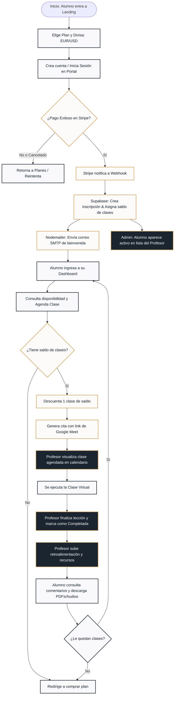

# 🇫🇷 Plataforma Web de Francés - Profesor Florentin
## Documentación General de Proyecto y Guía de Despliegue

Este documento recopila el contexto del negocio, los problemas que resuelve la plataforma, los flujos generales de compra y gestión, los costos de infraestructura y la guía de despliegue en producción.

---

## 📖 1. Propósito y Gestión General del Sistema (¿Para qué sirve?)

El sistema sirve como un ecosistema completo de **autogestión comercial y pedagógica** que automatiza las tareas operativas diarias del profesor Florentin y proporciona un espacio digital profesional y centralizado para sus estudiantes.

### ¿Qué problemas resuelve el sistema?
1.  **Elimina la coordinación manual de horarios:** En lugar de enviar decenas de mensajes por WhatsApp para coordinar una fecha y hora disponible para una clase, el alumno visualiza la agenda libre de Florentin directamente en el portal y reserva con un solo clic.
2.  **Lleva el control de saldos automáticamente:** Evita el uso de hojas de cálculo manuales. El sistema lleva el registro exacto de cuántas clases ha comprado cada alumno. Al agendar se le descuenta una clase; si cancela con anticipación, el saldo se le reintegra de inmediato de forma autónoma.
3.  **Independencia de intermediarios (Ahorro en comisiones):** Al no depender de plataformas externas (como Italki, Verbling o Preply) que cobran comisiones de hasta el 30% por lección, Florentin retiene el **100% del valor de su trabajo**.
4.  **Centralización del Material de Estudio:** El material didáctico (PDFs explicativos, lecturas y audios MP3) y las tareas no se pierden en correos electrónicos o chats; se organizan en el portal del alumno por niveles pedagógicos (A1-B2).
5.  **Historial y Retroalimentación Directa:** El alumno tiene visibilidad de las observaciones y comentarios que el profesor le deja después de cada lección, permitiéndole dar un seguimiento real a su progreso en el idioma.
6.  **Garantía de Pago Anticipado:** El sistema asegura que toda clase agendada esté previamente pagada mediante Stripe, eliminando problemas de morosidad o cancelaciones de última hora sin remunerar.

---

## 🔄 2. Flujo General de Compra e Interacción Pedagógica

El ciclo operativo del sistema sigue un flujo lógico e integrado entre el estudiante, la base de datos y el profesor:

## 🔄 2. Flujo General de Compra e Interacción Pedagógica

El ciclo operativo del sistema sigue un flujo lógico e integrado entre el estudiante, la base de datos y el profesor:

### Paso 1: Selección y Registro (Landing Page)
*   **Alumno:** Entra a la web, selecciona un plan en su moneda preferida (**EUR o USD**) y hace clic en adquirir.
*   **Sistema:** Le solicita crear una cuenta (o iniciar sesión si ya tiene una). El proceso de registro es instantáneo y optimizado para la conversión, ya que no requiere la validación obligatoria por correo electrónico, permitiendo que el alumno pase inmediatamente al checkout.

### Paso 2: Pago Seguro (Stripe Checkout)
*   **Alumno:** Es redirigido al portal seguro de Stripe, donde ingresa sus datos bancarios y realiza el pago.
*   **Stripe:** Procesa la transacción aplicando las normativas de seguridad europea (SCA) y notifica el cobro exitoso al servidor.
*   **Profesor:** Recibe el dinero directamente en su cuenta de Stripe conectada.

### Paso 3: Alta de Plan y Envío de Correo (Webhook)
*   **Sistema:** Al recibir la señal de Stripe, registra la compra en Supabase, activa el saldo correspondiente (8, 12 o 4 clases) y envía un correo de bienvenida automático al alumno mediante SMTP.
*   **Profesor:** Ve aparecer el nuevo estudiante con su plan activo en su lista del panel administrativo.

### Paso 4: Autogestión de Reservas y Horarios Globales
*   **Alumno:** Ingresa al portal y selecciona una fecha. El sistema **detecta automáticamente su país y huso horario (Timezone)**, traduciendo el horario laboral del profesor (ej. hora de París) a la hora local exacta del alumno.
*   **Sistema:** Calcula la disponibilidad en tiempo real mediante conversiones UTC para evitar solapamientos, descuenta 1 clase de su saldo y genera la cita asociándole un enlace de videoconferencia (Google Meet).
*   **Profesor:** Ve la nueva clase programada en su agenda y prepara la sesión.

### Paso 5: Feedback y Materiales (Clase Completada)
*   **Ambos:** Realizan la clase en vivo.
*   **Profesor:** Al terminar, marca la clase como "Completada" en su panel y escribe notas de progreso para el alumno. También puede asignarle materiales complementarios para descargar.
*   **Alumno:** Recibe el feedback del profesor en su panel y descarga las tareas para preparar la siguiente lección.

## 🛠️ 2. Arquitectura de Software y Lenguajes

El proyecto ha sido implementado bajo un enfoque moderno, unificado y sumamente eficiente en recursos, eliminando la necesidad de mantener múltiples servidores:

*   **Core / Framework:** **Next.js 16 (App Router)** utilizando **TypeScript** y React 19. El frontend (interfaz interactiva) y el backend (servidor de API, webhook y lógica) residen bajo el mismo codebase para minimizar latencias y costos.
*   **Estilo y Estética:** **CSS Puro** unificado para forzar un **Tema Claro Premium (Champán / Azul Medianoche)**, garantizando que el sitio se renderice idéntico en todos los navegadores (Brave, Chrome, Edge, Safari) sin importar si el usuario tiene activado el modo oscuro en su sistema operativo.
*   **Animaciones:** **Framer Motion** para animaciones interactivas fluidas, micro-interacciones hover y transiciones de texto dinámicas en el banner del héroe.
*   **Base de Datos y Sesiones (Supabase):**
    *   **PostgreSQL Relacional:** Estructura robusta para usuarios, inscripciones, clases programadas y recursos didácticos.
    *   **Supabase Auth:** Manejo seguro de inicio de sesión, creación de cuentas y validación de sesiones JWT.
*   **Envío de Correos (Nodemailer - SMTP):** Implementado con Nodemailer para conectarse directamente al servidor de correo corporativo del profesor (SMTP), evitando el pago de suscripciones a servicios externos de correo (como SendGrid, Resend o Mailgun).
*   **Integración de Pagos:** **Stripe Node SDK** para iniciar transacciones cifradas y escuchar notificaciones de cobro a través de rutas de Webhook seguras en el servidor.

---

## 💰 3. Infraestructura y Costos Mensuales Estimados (Producción)

El stack del proyecto se diseñó para tener **costo fijo mensual cero** en su etapa inicial de lanzamiento, de modo que solo pagues por el dominio anual y la comisión por transacciones vendidas:

| Servicio | Plataforma | Plan Recomendado | Costo Fijo Mensual | Notas / Detalles |
| :--- | :--- | :--- | :--- | :--- |
| **Alojamiento (Hosting)** | **Vercel** | Hobby / Starter | **0 USD** | Gratuito para proyectos de uso personal y profesional inicial. Soporta Next.js nativamente en la red perimetral CDN. |
| **Base de Datos y Auth** | **Supabase** | Free Tier | **0 USD** | Incluye base de datos PostgreSQL de hasta 500 MB (suficiente para miles de alumnos), autenticación ilimitada y 1 GB de almacenamiento. |
| **Servidor de Correo** | **Nodemailer** | SMTP local / cPanel | **0 USD** | Integrado de forma gratuita al usar el correo institucional corporativo que incluye el dominio del profesor. |
| **Pasarela de Pagos** | **Stripe** | Por transacción | **0 USD** | Solo cobra comisión si vendes: aprox. **1.4% a 2.9% + 0.25€/$0.30** por pago procesado con éxito. |
| **Dominio Personalizado** | **Hostinger / Namecheap** | Registro Anual | **~1.00 USD** *(~12 USD al año)* | Dominio oficial de Florentin (ej. `florentinfrances.com` o `.fr`). |
| **COSTO FIJO TOTAL** | | | **~1.00 USD / mes** | **Costo fijo de operación prácticamente nulo.** |

---

## 🚀 4. Guía de Despliegue Paso a Paso

Sigue esta guía técnica para configurar y lanzar la plataforma de Florentin a producción:

### Paso 1: Configurar la Base de Datos en Supabase
1.  Entra en [Supabase](https://supabase.com) y crea un nuevo proyecto.
2.  Una vez creado, ve al apartado **SQL Editor** en la barra lateral izquierda.
3.  Crea una consulta en blanco, copia todo el contenido del archivo [`supabase_schema.sql`](file:///c:/xampp/htdocs/proyecto%20Florentin/supabase_schema.sql) y haz clic en **RUN**. Esto creará:
    *   Las tablas `usuarios`, `inscripciones`, `clases` y `recursos`.
    *   La función de seguridad `es_admin`.
    *   Las políticas **Row Level Security (RLS)** que protegen los accesos de alumnos y el panel del profesor.
4.  Ve a **Settings > API** y copia la URL del proyecto (`Project URL`) y la clave anónima (`anon public key`). Las necesitarás para las variables de entorno.

### Paso 2: Configurar tu Cuenta de Stripe
1.  Regístrate o inicia sesión en [Stripe](https://stripe.com) y activa el modo de pruebas o el modo de producción.
2.  Crea tres productos correspondientes a los planes (Principiante, Intermedio, Pro) y guarda sus respectivos IDs de precio o mantén los números del catálogo.
3.  Ve al apartado de **Developers > Webhooks**.
4.  Crea un nuevo Endpoint de Webhook apuntando a la URL final de tu servidor (ej. `https://florentinfrances.com/api/webhooks/stripe`).
5.  Suscríbete exclusivamente al evento `checkout.session.completed`.
6.  Copia la clave secreta de firma del webhook (`whsec_...`).

### Paso 3: Configurar tu Servidor de Correo (SMTP)
Obtén las credenciales SMTP de tu correo corporativo (ej. `soporte@florentinfrances.com`) en tu panel de administración de hosting (Hostinger, cPanel, etc.):
*   `SMTP_HOST` (ej. `smtp.hostinger.com` o `mail.florentinfrances.com`)
*   `SMTP_PORT` (generalmente `465` para SSL, o `587` para TLS)
*   `SMTP_USER` (tu correo corporativo)
*   `SMTP_PASS` (la contraseña de dicho correo)
*   `SMTP_FROM` (el remitente visualizado, ej: `"Profesor Florentin <soporte@florentinfrances.com>"`)

### Paso 4: Desplegar en Vercel
1.  Sube el código de tu proyecto local a un repositorio privado en **GitHub**.
2.  Regístrate en [Vercel](https://vercel.com) y conecta tu cuenta de GitHub.
3.  Selecciona el repositorio de Florentin para importar el proyecto.
4.  En la sección **Environment Variables**, añade exactamente los siguientes campos con sus valores de producción:
    *   `NEXT_PUBLIC_SUPABASE_URL` (De Supabase)
    *   `NEXT_PUBLIC_SUPABASE_ANON_KEY` (De Supabase)
    *   `SUPABASE_SERVICE_ROLE_KEY` (De Supabase - Clave de servicio para omitir RLS en Webhooks)
    *   `NEXT_PUBLIC_STRIPE_PUBLISHABLE_KEY` (De Stripe)
    *   `STRIPE_SECRET_KEY` (De Stripe)
    *   `STRIPE_WEBHOOK_SECRET` (De Stripe)
    *   `SMTP_HOST` (De tu correo SMTP)
    *   `SMTP_PORT` (De tu correo SMTP)
    *   `SMTP_USER` (De tu correo SMTP)
    *   `SMTP_PASS` (De tu correo SMTP)
    *   `SMTP_FROM` (De tu correo SMTP)
    *   `NEXT_PUBLIC_APP_URL` (La URL oficial de tu dominio, ej: `https://florentinfrances.com`)
5.  Haz clic en **Deploy**. Vercel compilará, optimizará y publicará la aplicación en cuestión de segundos.

---

## 💡 5. Consejos Técnicos de Mantenimiento y Crecimiento

1.  **Limpieza y Optimización:** Next.js optimiza las imágenes de la Landing y minifica el código CSS/JS automáticamente en cada build. Evita instalar librerías externas pesadas de diseño para mantener la velocidad de carga en teléfonos móviles.
2.  **Seguridad de Base de Datos:** Las políticas RLS configuradas garantizan que ningún alumno pueda ver los datos o saldo de clases de otros alumnos, ni ver los recursos de niveles superiores a los asignados. Mantén siempre habilitado el RLS.
3.  **Ampliación del Calendario:** Actualmente el portal descuenta 1 clase de saldo por cita agendada en la tabla `inscripciones` y valida la disponibilidad del horario. En el futuro, puedes integrar APIs como Google Calendar para sincronizar y bloquear las horas libres de Florentin directamente en su calendario personal.

---

## 🛠️ 6. Historial de Mejoras y Optimizaciones Recientes (Julio 2026)

Se han implementado mejoras significativas en la robustez, seguridad y rendimiento del código:

### A. Limpieza de Dependencias
*   Se removieron las librerías redundantes de correo `@emailjs/browser` y `resend` del archivo [package.json](file:///c:/xampp/htdocs/proyecto%20Florentin/package.json), centralizando todo el despacho a través de **Nodemailer (SMTP)** para aprovechar el correo institucional gratuito del profesor y reducir el bundle size.

### B. Correcciones del Linter y TypeScript en page.tsx (Portal de Alumnos)
*   Se crearon interfaces estrictas para `PlanEstudio`, `Inscripcion` y `HoraDisponible`, eliminando los tipos genéricos `any[]`.
*   Se resolvió la advertencia de mutación de referencia global reemplazando la reasignación directa `window.location.href` por `window.location.assign()`.
*   Se resolvieron los renders en cascada del renderizado envolviendo las llamadas de `setState` en efectos con `setTimeout(..., 0)`.
*   Se aisló el cálculo de fecha impura `Date.now()` a un estado `minDateReprogramar` inicializado asíncronamente en el montaje, asegurando la pureza de la interfaz de Next.js.

### C. Reubicación y Seguridad de Scripts Utilitarios
*   Se creó el directorio `/scripts` para alojar los scripts de consola de Supabase.
*   **Eliminación de fugas de datos:** Se eliminaron las credenciales de Supabase hardcodeadas en texto plano en los archivos. Ahora se leen dinámicamente de las variables de entorno de forma segura.
*   Se configuraron alias ejecutables rápidos (`npm run check:clases` y `npm run check:recursos`) con soporte nativo para archivos de entorno (`--env-file`).

### D. Nuevas APIs y Lógica de Negocio
*   **Endpoint de Notificaciones:** Se implementó la API `/api/admin/enviar-notificacion/route.ts` para enviar correos electrónicos individuales o masivos utilizando Nodemailer y validando de forma segura que el usuario emisor sea un administrador.
*   **Creación de Alumnos Dinámica:** La API de inscripción manual `/api/admin/crear-alumno/route.ts` ahora consulta dinámicamente el plan desde la tabla `planes_estudio` para asignar el total de clases real, en lugar de usar un mapeo estático/hardcodeado.
*   **Preservación del Historial de Cancelación:** La API `/api/cancelar/route.ts` ahora marca la clase como `'cancelada'` de forma lógica en lugar de hacer una eliminación física `.delete()`.

### E. Integridad y Seguridad de Saldos (Rollbacks e Idempotencia)
*   **Idempotencia en Stripe:** El webhook de Stripe ahora realiza una comprobación previa del `stripe_session_id`. Si detecta un reintento del webhook, evita duplicar la inscripción o regalar clases gratis.
*   **Transacciones Atómicas:** Se añadieron rollbacks lógicos a las APIs de reserva y cancelación:
    *   Si se falla al descontar el saldo tras reservar una clase, se cancela la inserción de la clase.
    *   Si falla la cancelación de la clase en Supabase tras acreditar el saldo de devolución, se revierte el saldo del alumno al valor original para evitar saldos inconsistentes.

### F. Esquema SQL y Políticas RLS Restringidas
*   Se actualizó el script [supabase_schema.sql](file:///c:/xampp/htdocs/proyecto%20Florentin/supabase_schema.sql) para incluir las definiciones de la tabla `recursos_asignados` y las columnas faltantes de `clases` (`reprogramaciones_restantes` y `enlace_grabacion`).
*   Se endureció el RLS: Los alumnos ya no pueden realizar `UPDATE` ni `DELETE` directos a la tabla `clases` (forzándolos a usar las APIs seguras), y la lectura de `recursos` se limitó únicamente a materiales asignados individualmente.
